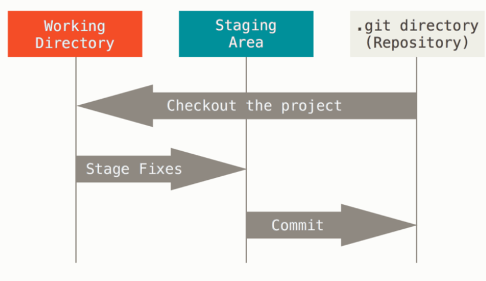

- [Foundations](https://www.theodinproject.com/paths/foundations/courses/foundations)
- intro
  collapsed:: true
	- [HowCourseWillWork](https://www.theodinproject.com/lessons/foundations-how-this-course-will-work)
	- [IntroToWebDev](https://www.theodinproject.com/lessons/foundations-introduction-to-web-development)
	  collapsed:: true
		- **Full-stack developers** are comfortable working with both the front and back ends. At The Odin Project, we focus on teaching you full-stack development, covering all aspects of web development.
		- **Tools**
		  Git
		  GitHub
		  StackOverflow
		  Cli
		  TextEditor
		  Google
		- **Motivation**
		  People tend to care more about what you’ve actually **built** than how you got there.
		- [contribute](https://www.theodinproject.com/contributing)
	- [Motivation And Mindset](https://www.theodinproject.com/lessons/foundations-motivation-and-mindset)
	  collapsed:: true
		- I want to solve every problem
		- **Growth Mindset**
		  believes they can get better at anything with effort and persistence.
		- What does this mean for you? It means you can learn new skills and develop new talents with **persistence and grit**.
		- **Focus mode** occurs when you are consciously focusing on learning, reading, watching videos, or working on a project.
		- **Diffuse mode** occurs subconsciously, at times when you are not actively learning, such as when you’re doing the dishes, exercising, or sleeping. In this state, your mind goes about the business of connecting what you have been learning to the other things you know. This is where breakthroughs happen
		- In short, **understand** it, **practice** it, and finally **teach** it.
		- **Unstuck**
		  Google it
		  Take a break
		  Askforhelp
		- **Pitfalls to Avoid**
			- **Procastination**
			  Pomodoro technique good for avoiding Procastinating
			- Avoid digital distraction
			- Avoid physical distraction
			- Avoid being help vampire
			- Rabbit Holes
			  stick to the path
			- Compare yourself and be proud of yourself
			-
	- [Asking for help](https://www.theodinproject.com/lessons/foundations-asking-for-help)
	  collapsed:: true
		- Always Provide Your Code and the Surrounding Context
		- Ask About the Problem at Hand, Not the Solution Itself
		- Don’t Take Asking for More Context to Heart
		- **Template for asking for help**
		  What do you think the problem is?
		  What exactly do you want to happen?
		  What is actually happening?
		  How did you get there?
		  What have you tried so far?
		  Screenshot
		- **Rubber duck debugging**
		  Break down the problem
- pre
  collapsed:: true
	- [backupPassword](https://edu.gcfglobal.org/en/techsavvy/sharing-photos-privately/1/)
	- how web work
		- [What is a web server?](https://developer.mozilla.org/en-US/docs/Learn/Common_questions/Pages_sites_servers_and_search_engines)
			- A computer that hosts a website on the internet
		- website
			- a collection of web pages which are grouped together and usually connected together in various ways.
		- [What is a network?](https://developer.mozilla.org/en-US/docs/Learn/Common_questions/How_does_the_Internet_work)
			- simple network
			  * router for connecting multiple computers
			- network of networks
			  * connecting routers to routers
			  * modem turn info that can be send a cross the world
			  * ISP manage routers and connect with other ISPs routers
			- finding computers
			  * IP address is the address of a computer or devices.
			  * DNS is the easiest way for human to connect internet
			- internet and the web
			  * internet is an infrastructure
			  * the Web is a service built on top of the infrastructure
			- intranet
			  * *private* networks that are restricted to members of a particular organization.
			- extranet
			  * Extranets are very similar to Intranets, except they open all or part of a private network to allow sharing and collaboration with other organizations.
			- intranet and extranet same kind of infrastructure as internet and use same protocol
			  * can be access by authorize members from different physical locations.
		- [What is the internet?](https://www.youtube.com/watch?v=7_LPdttKXPc&t=46s)
			- The Internet is a technical infrastructure which allows billions of computers to be connected all together.
		- [What is an IP address?](https://developer.mozilla.org/en-US/docs/Learn/Common_questions/How_does_the_Internet_work)
			- Internet Protocol 
			  * IP address is unique identification of computers or devices
			  * devices used it for communications.
		- [What is a router?](https://developer.mozilla.org/en-US/docs/Learn/Common_questions/How_does_the_Internet_work)
			- Router
			  * Is like a signaler at a railway station
			  * Manage data send from one device or computer another.
		- [What is an ISP?](https://developer.mozilla.org/en-US/docs/Learn/Common_questions/How_does_the_Internet_work)
			- Internet Service Provider (ISP)
			  * A company that manages some special *routers* that are all linked together 
			  * and can also access other ISPs' routers.
		- [What are packets and how are they used to transfer data?](https://developer.mozilla.org/en-US/docs/Learn/Getting_started_with_the_web/How_the_Web_works#clients_and_servers)
		- [What is a client?](https://developer.mozilla.org/en-US/docs/Learn/Getting_started_with_the_web/How_the_Web_works#clients_and_servers)
			- Clients are the typical web user's internet-connected devices
		- [What is a server?](https://developer.mozilla.org/en-US/docs/Learn/Getting_started_with_the_web/How_the_Web_works#clients_and_servers)
			- Servers are computers that store webpages, sites, or apps
		- How Client and Server work together?
			- **Your internet connection**: Allows you to send and receive data on the web. It's basically like the street between your house and the shop.
			- **TCP/IP**: Transmission Control Protocol and Internet Protocol are communication protocols that define how data should travel across the internet. This is like the transport mechanisms that let you place an order, go to the shop, and buy your goods. In our example, this is like a car or a bike (or however else you might get around).
			- **DNS**: Domain Name System is like an address book for websites. When you type a web address in your browser, the browser looks at the DNS to find the website's IP address before it can retrieve the website. The browser needs to find out which server the website lives on, so it can send HTTP messages to the right place (see below). This is like looking up the address of the shop so you can access it.
			- **HTTP**: Hypertext Transfer Protocol is an application [protocol](https://developer.mozilla.org/en-US/docs/Glossary/Protocol) that defines a language for clients and servers to speak to each other. This is like the language you use to order your goods.
			- **Component files**: A website is made up of many different files, which are like the different parts of the goods you buy from the shop. These files come in two main types:
				- **Code files**: Websites are built primarily from HTML, CSS, and JavaScript, though you'll meet other technologies a bit later.
				- **Assets**: This is a collective name for all the other stuff that makes up a website, such as images, music, video, Word documents, and PDFs.
		- How client parse ?
			- When browsers send requests to servers for HTML files, those HTML files often contain [`<link>`](https://developer.mozilla.org/en-US/docs/Web/HTML/Element/link) elements referencing external [CSS](https://developer.mozilla.org/en-US/docs/Learn/CSS) stylesheets and [`<script>`](https://developer.mozilla.org/en-US/docs/Web/HTML/Element/script) elements referencing external [JavaScript](https://developer.mozilla.org/en-US/docs/Learn/JavaScript) scripts. It's important to know the order in which those files are [parsed by the browser](https://developer.mozilla.org/en-US/docs/Web/Performance/How_browsers_work#parsing) as the browser loads the page:
			- The browser parses the HTML file first, and that leads to the browser recognizing any `<link>`-element references to external CSS stylesheets and any `<script>`-element references to scripts.
			- As the browser parses the HTML, it sends requests back to the server for any CSS files it has found from `<link>` elements, and any JavaScript files it has found from `<script>` elements, and from those, then parses the CSS and JavaScript.
			- The browser generates an in-memory [DOM](https://developer.mozilla.org/en-US/docs/Web/API/Document_Object_Model) tree from the parsed HTML, generates an in-memory [CSSOM](https://developer.mozilla.org/en-US/docs/Glossary/CSSOM) structure from the parsed CSS, and [compiles and executes](https://developer.mozilla.org/en-US/docs/Web/Performance/How_browsers_work#javascript_compilation) the parsed JavaScript.
			- As the browser builds the DOM tree and applies the styles from the CSSOM tree and executes the JavaScript, a visual representation of the page is painted to the screen, and the user sees the page content and can begin to interact with it.
		- Packets
		  * sending packets in chunk is better because the server must manage multiple clients.
		- [What is a web page?](https://developer.mozilla.org/en-US/docs/Learn/Common_questions/Pages_sites_servers_and_search_engines)
			- A document which can be displayed in a web browser
			- style informations
			  * scripts
			  * media
		- [What is a web browser?](https://www.youtube.com/watch?v=BrXPcaRlBqo&feature=youtu.be)
			- a program that allow you to websites like firefox, chrome, edge.
		- [What is a search engine?](https://developer.mozilla.org/en-US/docs/Learn/Common_questions/Pages_sites_servers_and_search_engines)
			- A web service that helps you find other web pages.
		- [What is a DNS request?](https://www.youtube.com/watch?v=72snZctFFtA&t=45s)
			- Domain Name Service - Translate web address to IP address that match.
			  * is like an address book for websites. 
			  * When you type a web address in your browser, the browser looks at the DNS to find the website's IP address before it can retrieve the website. 
			  * The browser needs to find out which server the website lives on, so it can send HTTP messages to the right place (see below). 
			  * This is like looking up the address of the shop so you can access it.
			- OS > resolving name server > check in cache first if not exist > root name server > com name server TLD > authoritative name server > registrar
			- resolving name server > cache > OS
			- OS > use IP address to visit the site
		- [Which browser are you currently using?](https://www.whatsmybrowser.org/)
			- edge 108
		- [In your own words, explain what happens when you run a search on google.com.](https://developer.mozilla.org/en-US/docs/Learn/Common_questions/Pages_sites_servers_and_search_engines)
			- When you type a web address into your browser (for our analogy that's like walking to the shop):
			- The browser goes to the DNS server, and finds the real address of the server that the website lives on (you find the address of the shop).
			- The browser sends an HTTP request message to the server, asking it to send a copy of the website to the client (you go to the shop and order your goods). This message, and all other data sent between the client and the server, is sent across your internet connection using TCP/IP.
			- If the server approves the client's request, the server sends the client a "200 OK" message, which means "Of course you can look at that website! Here it is", and then starts sending the website's files to the browser as a series of small chunks called data packets (the shop gives you your goods, and you bring them back to your house).
			- The browser assembles the small chunks into a complete web page and displays it to you (the goods arrive at your door — new shiny stuff, awesome!).
	- [installation](https://www.theodinproject.com/lessons/foundations-installations)
	  collapsed:: true
		- install xubuntu
		  follow the recommended instructions or a bit higher if you have more space
		- update and upgrade
		- install build-essential
		- install vmware tools or Guests from virtual box
		- install chrome
			- ```bash
			  # Download
			  wget https://dl.google.com/linux/direct/google-chrome-stable_current_amd64.deb
			  # install
			  sudo apt install ./google-chrome-stable_current_amd64.deb
			  # remove
			  rm google-chrome-stable_current_amd64.deb
			  # start chrome
			  google-chrome
			  ```
		- install vscode
			- ```bash
			  # download vscode
			  wget -O code-latest.deb 'https://code.visualstudio.com/sha/download?build=stable&os=linux-deb-x64'
			  
			  # install vscode 
			  sudo apt install ./code-latest.deb
			  
			  # remove vscode 
			  rm code-latest.deb
			  
			  # using vscode 
			  code .
			  ```
		-
	- [[linuxbasic]]
	- install git
	  collapsed:: true
		- ```git
		  
		  # Update the system
		  sudo apt update
		  sudo apt upgrade
		  # install git
		  sudo add-apt-repository ppa:git-core/ppa
		  sudo apt update
		  sudo apt install git
		  
		  # git version check
		  git --version
		  ```
	- setup git
	  collapsed:: true
		- ```git
		  # setup user name and email
		  git config --global user.name "Your Name"
		  git config --global user.email "yourname@example.com"
		  
		  # private email
		  git config --global user.email "123456789+odin@users.noreply.github.com" # Remember to use your own private GitHub email here.
		  
		  # change default branch on new repositor master to main
		  git config --global init.defaultBranch main
		  
		  # enable colorful output git
		  git config --global color.ui auto
		  
		  # Set your default branch reconciliation behavior to merging
		  git config --global pull.rebase false
		  
		  # verify git commands 
		  git config --get user.name
		  git config --get user.email
		  
		  # macOS Users: ignore .DS_Store 
		  # .DS_Store collect metadata for folder
		  echo .DS_Store >> ~/.gitignore_global
		  git config --global core.excludesfile ~/.gitignore_global
		  ```
	- Create SSH Key for git
	  collapsed:: true
		- ```bash
		  # SSH - cryptographically secure identifier for your machine
		  # allow us to upload our repository without having to type username and password everytime
		  
		  # check if Ed25519 algorithm SSH key already installed
		  ls ~/.ssh/id_ed25519.pub
		  
		  # if message "No such file or directory" appear create algorithm
		  # location for saving generated key Enter and continue
		  # if ask for password enter one or don't and not required
		  ssh-keygen -t ed25519 -C <youremail>
		  
		  #Link Your SSH Key with GitHub
		  Settings > SSH and GPG keys > New SSH Key > "name your key something" > leave this window open
		  
		  cat ~/.ssh/id_ed25519.pub
		  
		  highlight and copied out put start with ssh-ed25519 and end with email
		  paste key field windows previous open > Add SSH Key
		  
		  passphrase: odinpj
		  githubpublicemail: 17211423+Zumh@users.noreply.github.com
		  ```
		- [Verify SSH connection](https://docs.github.com/en/authentication/connecting-to-github-with-ssh/testing-your-ssh-connection?platform=linux)
			- ```bash
			  $ ssh -T git@github.com
			  # Attempts to ssh to GitHub
			  
			  # output 
			  > The authenticity of host 'github.com (IP ADDRESS)' can't be established.
			  > RSA key fingerprint is SHA256:nThbg6kXUpJWGl7E1IGOCspRomTxdCARLviKw6E5SY8.
			  > Are you sure you want to continue connecting (yes/no)?
			  enter: yes
			  
			  # should be 
			  > Hi USERNAME! You've successfully authenticated, but GitHub does not
			  > provide shell access.
			  
			  # If there is more error go to the github ssh verification link from the top
			  ```
- gitbasic
	- why git?
	  collapsed:: true
		- Speed
		- Simple design
		- Strong support for non-linear development (thousands of parallel branches)
		- Fully distributed
		- Able to handle large projects like the Linux kernel efficiently (speed and data size)
	- the three states
	  collapsed:: true
		- Modified means that you have changed the file but have not committed it to your database yet.
		- Staged means that you have marked a modified file in its current version to go into your next commit snapshot.
		- Committed means that the data is safely stored in your local database.
		- 
	- workflow
	  collapsed:: true
		- You modify files in your working tree.
		- You selectively stage just those changes you want to be part of your next commit, which adds only those changes to the staging area.
		- You do a commit, which takes the files as they are in the staging area and stores that snapshot permanently to your Git directory.
- gitusage
  collapsed:: true
	- ```git
	  # version check
	  git --version
	  
	  # set local default branch to main
	  git config --global init.defaultBranch main 
	  ```
	- [create repositories](https://www.theodinproject.com/lessons/foundations-git-basics#introduction)
	- git cheatsheet
		- version check or verified we clone the right repos after clone
		  cd <repository folder>
		  git remote -v
		- Commands related to a remote repository:
			- `git clone git@github.com:USER-NAME/REPOSITORY-NAME.git`
			- `git push`  or  `git push origin main`  (Both accomplish the same goal in this context) 
			  we can also push to different branch if we want
		- Commands related to the workflow:
			- `git add .` - put create files to staging state
			- `git commit -m "A message describing what you have done to make this snapshot different"` - put files to commit stage and it take snapshot that can be upload to remote repos
		- Commands related to checking status or log history
			- `git status` - check if the status of local files
			- `git log` - show the detail about the author and time commited
		- The basic Git syntax is  `program | action | destination` .
		- vscode git
		  this command will make Visual Studio Code open a new tab with the ability to write your commit message and an optional description below it:  `git config --global core.editor "code --wait"` .
		  this will allow us to use vscode for editing commit message
		  git commit
	- git reasons
		- Best practices:
		  Two helpful best practices to consider are **atomic commits** and leveraging those atomic commits to make your commit messages more useful to future collaborators.
		- There are two main reasons for doing this:
			- first, if something you change turns out to cause some problems, it is easy to revert the specific change without losing other changes; and
			- second, it enables you to write better commit messages. You’ll learn more about what a good commit message looks like in a future lesson!
- HTML Foundations
  collapsed:: true
	- Assignments
		- What do HTML and CSSS stand for?
		  * HTML is a programming language that stands for Hypertext Markup Language.
		  * CSS stands for (Cascading Style Sheets).
		- Between HTML and CSS, which would you use for putting parragraphs of text ona webpage?
		  * I would use HTML.
		  * HTML is the raw data that a webpage is built out of. All the text, links, cards, lists, and buttons are created in HTML.
		- Between HTML and CSS which would you use for changing the font and background color of a button?
		  * I would use CSS.
		  * CSS is what adds *style* to those plain elements. 
		  * HTML puts information on a webpage, and CSS positions that information, gives it color, changes the font, and makes it look great!
		- What is the difference between HTML, CSS and JavaScript?
			- HTML is a language that determines how documents and web pages are displayed in a web browser, the language for the building blocks of any website.
			- CSS (Cascading Style Sheets) is a popular style sheet language that determines how a document created in HTML is styled (colors, font styles, layout and responsive features).
			- JavaScript allows you to change CSS and HTML elements on your website after the site has been loaded, which gives you the ability to make your site more interactive and engaging for users.
- HTML Elements and tags
  collapsed:: true
	- What is an HTML tag?
	  HTML tags are just content wrapper for html.
	  We use angle bracket for identifying tags. It has opening and closing tags
	- What is element?
	  You can think of elements as containers for content. The opening and closing tags tell the browser what content the element contains. The browser can then use that information to determine how it should interpret and format the content.
	- What are the three parts of an HTML element?
	  opening tag
	  content
	  closing tag
- HTML Boiler plate
  collapsed:: true
	- Create boiler plate html files
	  * index.html - server search for this file when trying to render a web page
	  * vscode shortcut for boiler plate - ! + enter
	- What is the purpose of the doctype declaration?
	  The doctype’s purpose is to tell the browser what version of HTML it should use to render the document. The latest version of HTML is HTML5, and the doctype for that version is simply \<!DOCTYPE html>.
	- What is the HTML element?
	  This is what’s known as the root element of the document, meaning that every other element in the document will be a descendant of it.
	- What is the purpose of the head element?
	  The \<head> element is where we put important meta-information **about** our webpages, and stuff required for our webpages to render correctly in the browser. Inside the \<head>, we **should not** use any element that displays content on the webpage.
	- What is the purpose of the body element?
	  This is where all the content that will be displayed to users will go - the text, images, lists, links, and so on.
- HTML Working with text
  collapsed:: true
	- How do you create a paragraph in HTML?
	  * A paragraph element is defined by wrapping text content with a \<p> tag.
	- How do you create a heading in HTML?
	  * \<h1>\</h1> and so on..
	  * larger and bolder than other text to signify that they are headings
	- How many different levels of headings are there and what is the difference between them?
	  * 6 level of different heading
	  * h1 is the most important largest and h6 is the tiniest lowest level
	- What element should you use to make text bold and important?
	  * \<strong>\</strong> element should be use for bolding and important element.
	- What element should you use to make text italicized to add emphasis to it?
	  * \<em>\</em> should be use for emphasis or italicized element.
	- What relationship does an element have with any nested elements within it?
	  * Nested elements have parent and child relationship betweeen them.
	- What relationship do two elements have if they are at the same level of nesting?
	  * Elements with same level of nesting are sibling.
	- How do you create HTML comments?
	  * \<!-- --\>
- HTML Lists
  collapsed:: true
	- What HTML tag is used to create an unordered list?
	  * \<ul>\<li>\</lis>\</ul>
	- What HTML tag is used to create an ordered list?
	  * \<ol>\<li>\</li>\</ol>
	- What HTML tag is used to create list items within both unordered and ordered lists?
	  * \<li>\</li> is used within ordered and unordered list tags
- HTML Links and Imags
  collapsed:: true
	- What element is used to create a link?
	  * \<a href="google.com">click to open google.com\</a>
	  anchor elements with hyper link reference attribute
	- What is an attribute?
	  * An HTML attribute gives additional information to an HTML element and always goes in the element’s opening tag. An attribute is usually made up of two parts: a name, and a value; however, not all attributes require a value.
	- What attribute tells links where to go to?
	  * hyperlink reference or \<href.> tell where to go to
	  locally or remote sites
	- What is the difference between an absolute and relative link?
	  * **Absolute** links to pages on other websites on the internet are called absolute links. protocol://domain/path
	  * **Absolute** always contain the protocol and domain of the destination.
	  
	  * **Relative** links to other pages within our own website are called relative links. 
	  * **Relative** links assumes the domain name will be the same as the page we created the link on.
	- Which element is used to display an image?
	  * \
	- What two attributes do images always need to have?
	  * images need src and alt attribute.
	- How do you access a parent directory in a filepath?
	  * ../
	- What are the four main image formats that you can use for images on the web?
	  * JPG, GIF, PNG, SVG
- Commit Messages
  collapsed:: true
	- [What are two benefits of having well-written commit messages and a good commit history?](https://cbea.ms/git-commit/#intro)
	  * reminder for future self
	  * let co worker know what has changed and improve.
	- [How many characters should the subject line of your commit message be?](https://cbea.ms/git-commit/#limit-50)
	  * 50 characters should be a commit message
	- Commit template
	  Author:
	  Date:
	  Title:
	  Description:
- [odin-recipes](https://zumh.github.io/odin-recipes/)
  This is a mini project for html foundations
- css foundaion
	- [What are the main differences between external, internal, and inline CSS?](https://www.theodinproject.com/lessons/foundations-css-foundations#external-css)
		- External - involves creating a separate file for the CSS and linking it inside of an HTML’s opening and closing `<head>` tags with a self-closing `<link>` element
		  ```css
		  <head>
		    <link rel="stylesheet" href="styles.css">
		  </head>
		  ```
		- Internal - Internal CSS (or embedded CSS) involves adding the CSS within the HTML file itself instead of creating a completely separate file.
		  ```
		   <head>
		    <style>
		      p {
		        color: red;
		      }
		    </style>
		  </head>
		  ```
		- Inline - Inline CSS makes it possible to add styles directly to HTML elements
		  ```css
		  <body>
		    <div style="color: white; background-color: black;">...</div>
		  </body>
		  ```
	- [What is the syntax for class and ID selectors?](https://www.theodinproject.com/lessons/foundations-css-foundations#class-selectors)
	  collapsed:: true
		- class and ID selectors
		  * class 
		  ```css
		  <div class="alert-text">
		  	Please agree to our terms of service.
		  </div>
		  .alert-text {
		    color: red;
		  }
		  ```
		  * ID selectors
		  ```css
		  <div id="title">My Awesome 90's Page</div>
		  #title {
		    background-color: red;
		  }
		  ```
	- [How would you apply a single rule to two different selectors?](https://www.theodinproject.com/lessons/foundations-css-foundations#grouping-selector)
		- we can apply single rule for two different selectors using comma
		  ```css
		  .read,
		  .unread {
		    color: white;
		    background-color: black;
		  }
		  ```
	- [Given an element that has an id of `title` and a class of `primary`, how would you use both attributes for a single rule?](https://www.theodinproject.com/lessons/foundations-css-foundations#chaining-selectors)
		- chain rule - combine id of title and class of primary for single rule
		  ```css
		  <div>
		    <div class="subsection header">Latest Posts</div>
		    <p class="subsection preview">something heere.</p>
		  </div>
		  .subsection.header {
		    color: red;
		  }
		  ```
	- [What does the descendant combinator do?](https://www.theodinproject.com/lessons/foundations-css-foundations#descendant-combinator-description)
		- A descendant combinator will only cause elements that match the last selector to be selected if they also have an ancestor (parent, grandparent, etc) that matches the previous selector.
	- [Between a rule that uses one class selector and a rule that uses three type selectors, which rule has the higher specificity?](https://www.theodinproject.com/lessons/foundations-css-foundations#high-specificity-class-type)
		- Selector specifity
		  * An ID selector will always beat any number of class selectors,
		  * a class selector will always beat any number of type selectors, and 
		  * a type selector will always beat any number of anything less specific than it.
		- When no declaration has a selector with a higher specificity, 
		  * a larger amount of a single selector will beat a smaller amount of that same selector.